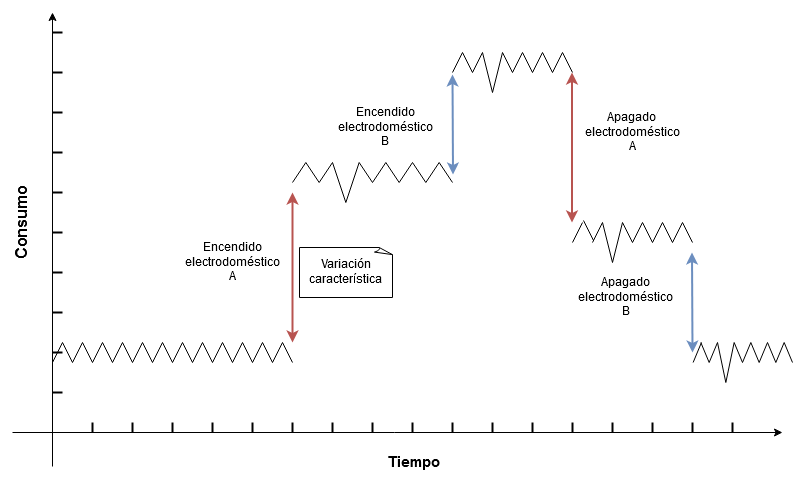

# Introducción

El aumento del consumo eléctrico es una tendencia a nivel mundial y cada vez más es el interés por la eficiencia energética. Uruguay no es ajeno a
esta realidad, entre los objetivos planteados por UTE para el año 2019 se encuentra la optimización del uso de la energı́a disponible ası́ como también la
incorporación de fuentes energéticas renovables.
El consumo residencial conforma gran parte de la demanda energética
de un paı́s, en la búsqueda por mejorar el aprovechamiento de los recursos
energéticos es deseable contar con información de consumo desagregada por electrodoméstico.
Esta información permitirı́a la creación de planes de consumo adaptados a diferentes sectores de la población y brindar recomendaciones
personalizadas a los usuarios para fomentar el ahorro energético. Siendo aún
más ambiciosos, si se contara con la información en tiempo real, se podrı́an
desarrollar mecanismos de encendido y apagado remoto e incluso detectar el
funcionamiento erróneo de los electrodomésticos de un hogar. Debido a la dificultad y costo de instalar medidores especı́ficos por cada aplicación en todas las
residencias de una localidad, es de interés desarrollar técnicas que sean capaces
de brindar estos datos a través de las mediciones agregadas tradicionales.
La caracterización energética es el proceso mediante el cual se busca identificar que elementos provocan una medida agregada de consumo eléctrico. En el caso de hogares, consiste en determinar los electrodomésticos que se encuentran encendidos según el registro de consumo total indicado por su contador.
Este tipo de técnicas se basan en el análisis de las firmas particulares de consumo que presentan los electrodomésticos y la conducta rutinaria de las personas que los utilizan.

