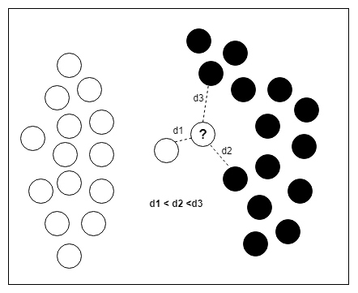

# Implementación

Se abordó el problema de caracterización energética implementando cuatro clasificadores: 

  * Clasificador basado en Naive Bayes
  * Clasificador basado en K Nearest Neighbours
  * Clasificador basado en redes de perceptrón multicapa
  * Clasificador basado en redes Long Short Term Memory

### Naive Bayes

Naive Bayes es un algoritmo de clasificación supervisado que utiliza el teorema de Bayes para el cálculo de la probabilidad condicional, con el fin de determinar cuál es la clase más probable a la que puede pertenecer un elemento a clasificar. El término “naive” significa ingenuo y hace referencia a que este método asume la independencia condicional entre cada una de las caracterı́sticas presentes en la entrada.

Naive Bayes fue seleccionado como primera aproximación porque es un algoritmo probabilístico sencillo, de referencia para contrastar los resultados obtenidos por algoritmos más complejos.

### K Nearest Neighbours

K Nearst Neighbours (KNN) es un algoritmo de clasificación que asigna un elemento a la la clase con mas representantes entre los K vecimos mas cercanos. En problemas de clasificación donde se usa KNN se estila elegir un número de vecinos impar para evitar posibles empates cuando se trabaja en clasificación binaria. KNN es muy sensible a los valores que se le asignan al número K de vecinos, de modo que con distintos valores se pueden obtener resultados muy dispares.

Suponiendo que se quiere clasificar un punto como blanco o negro, tal y como se muestra en la Figura 3.1. Si K = 1 la clasificación es que pertenece al conjunto de los puntos blancos. Cuando solo se considera el vecino más cercano puede ocurrir que un punto anómalo guı́e al clasificador hacia soluciones erróneas. Para K = 3 se asigna al conjunto de los puntos negros. En una de sus variantes se puede incorporar la distancia de los vecinos en la decisión.

### Redes Perceptrón Multicapa

Las redes neuronales son métodos de aprendizaje automático basados en la estructura biológica de las neuronas. Un primer acercamiento al modelado de redes neuronales fue mediante el perceptrón. El perceptrón es el modelo más simple de redes neuronales. Consiste en una única neurona, donde a cada conexión de entrada se le asigna un peso adaptativo. Si la suma de las entradas ponderadas por los pesos definidos es mayor a cierto umbral se produce una activación. Por su naturaleza el perceptrón sólo será capaz de resolver aquellos problemas donde el conjunto de datos sea linealmente separable. Por tanto, surge la necesidad de desarrollar estructuras más complejas con mayor cantidad de neuronas y capas que se interconectan. Aparecen entonces las redes de perceptrones multicapa (MLP, Multi Layer Perceptron) que son un conjunto de perceptrones donde solo se permiten las conexiones hacia adelante y las funciones de activación de las neuronas pueden ser no lineales.

### Redes Long Short Term Memory

Otra variante de red neuronal con el que se experimentó fueron las redes neuronales LSTM (Long Short Term Memory). Estas redes pertenecen a la familia de la redes neuronales recurrentes, en donde se permiten no solo conexiones hacia adelante entre neuronas, sino que también hacia atrás. Las redes recurrentes fueron diseñadas para abordar problemas de secuencia, es decir, problemas donde las entradas tienen cierta dependencia temporal.
La característica principal de una red LSTM es que sus neuronas que se denominan “células” se encargan de guardar información al igual que una memoria. Toman como entradas lo calculado en el paso anterior y la entrada del vector y mediante un método de caja negra deciden qué guardar y qué borrar de la memoria. Luego de esto, las neuronas calculan la salida con lo guardado actualmente en la memoria, la entrada del vector y lo calculado en el paso anterior. La información que se agrega o remueve de la célula está cuidadosamente regulada por ciertas estructuras que reciben el nombre de puertas (gates). Dichas puertas permiten saber qué información de la que estaba anteriormente almacenada se va a utilizar, que de la actual se va a guardar y que de lo calculado en este período va a ser retornado como el resultado.

Se construyeron varias arquitecturas con el objetivo de poder encontrar el mejor clasificador para cada uno de los distintos electrodomésticos considerados en el estudio. Las arquitecturas trabajadas fueron:

  * LSTM simple: Esta variante está conformada por una sola capa de LSTM seguida de una capa totalmente conectada (densa). Para la primer capa, la cantidad de neuronas se estableció en 128, se escogió como función de activación ReLU. La segunda capa cuenta con una sola neurona en la variante binaria y *n* (cantidad de estados de consumo de un electrodoméstico) neuronas para la variante de multiples niveles de consumo y una función de activación sigmoid. 

  * LSTM apilado: En este caso se construyó una estructura compuesta por tres capas LSTM y una capa totalmente conectada. La primer capa posee 128 neuronas y su función de activación es TanH (tangente hiperbólica). La segunda y la tercera capas comparten la misma función de activación que la primera, pero se componen de 256 y 128 neuronas respectivamente. El último componente cuenta con una neurona en la variante binaria y *n* (cantidad de estados de consumo de un electrodoméstico) neuronas para la variante de multiples niveles de consumo y una función de activación de tipo sigmoid.
  
  * LSTM apilado bidireccional: Mantiene la base de estructura del caso anterior pero en esta oportunidad las primeras dos capas no son simples LSTM, sino que son LSTM bidireccionales. Asímismo, se comparten las cantidades de neuronas y funciones de activación de las capas.
  
  * CNN-LSTM: Finalmente, la última configuración mezcla dos tipos de redes neuronales y busca aprovechar las cualidades de ambas. En primer lugar, se intenta extraer las características de los datos de entrada apoyándose en redes CNN para luego poder trabajar con problemas de secuencia mediante el uso de LSTM. Se compone de una capa convolucional de 64 filtros con función de activación ReLU, seguido de una capa MaxPooling1D con un tamaño de ventana igual a dos y una capa de tipo Flatten. A continuación se agregan dos capas más, la primera una LSTM con 128 neuronas y función de activación ReLU. Para culminar una capa completamente conectada compuesta por una neurona en la variante binaria y *n* (cantidad de estados de consumo de un electrodoméstico) neuronas para la variante de multiples niveles de consumo y sigmoid como función de activación.  