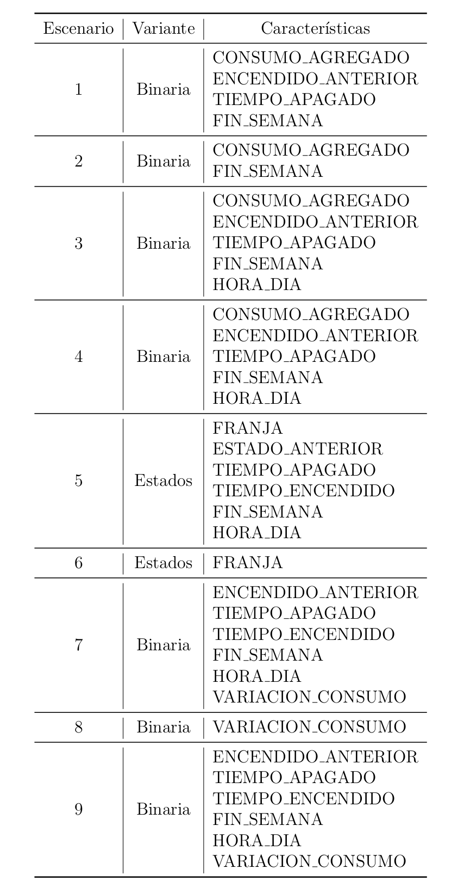
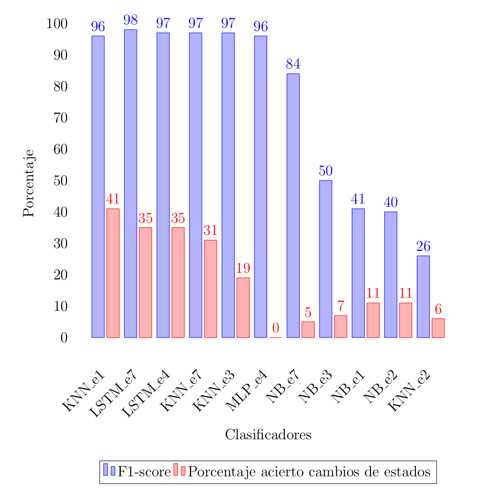
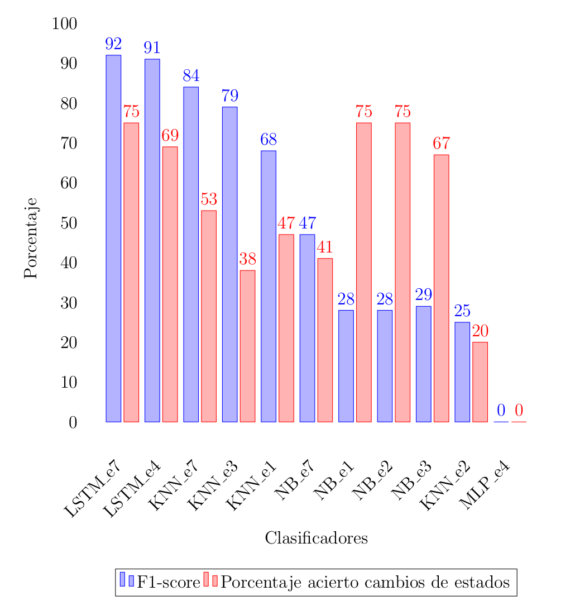
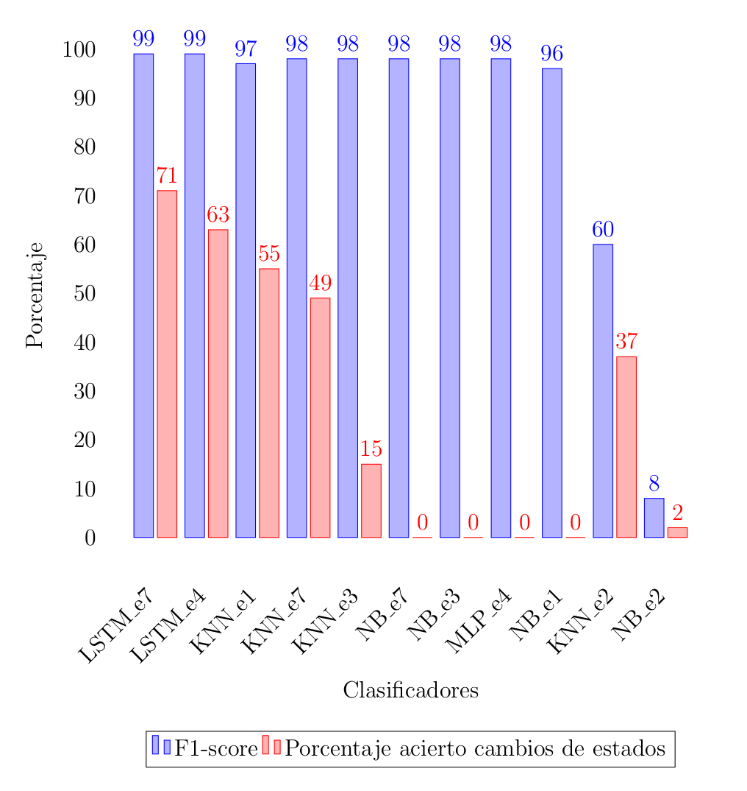
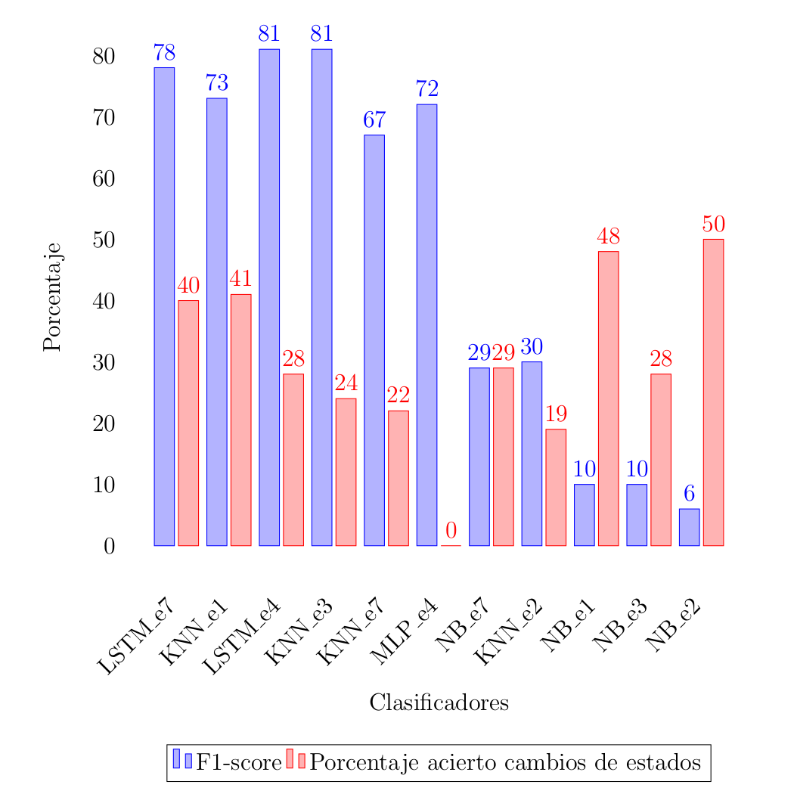
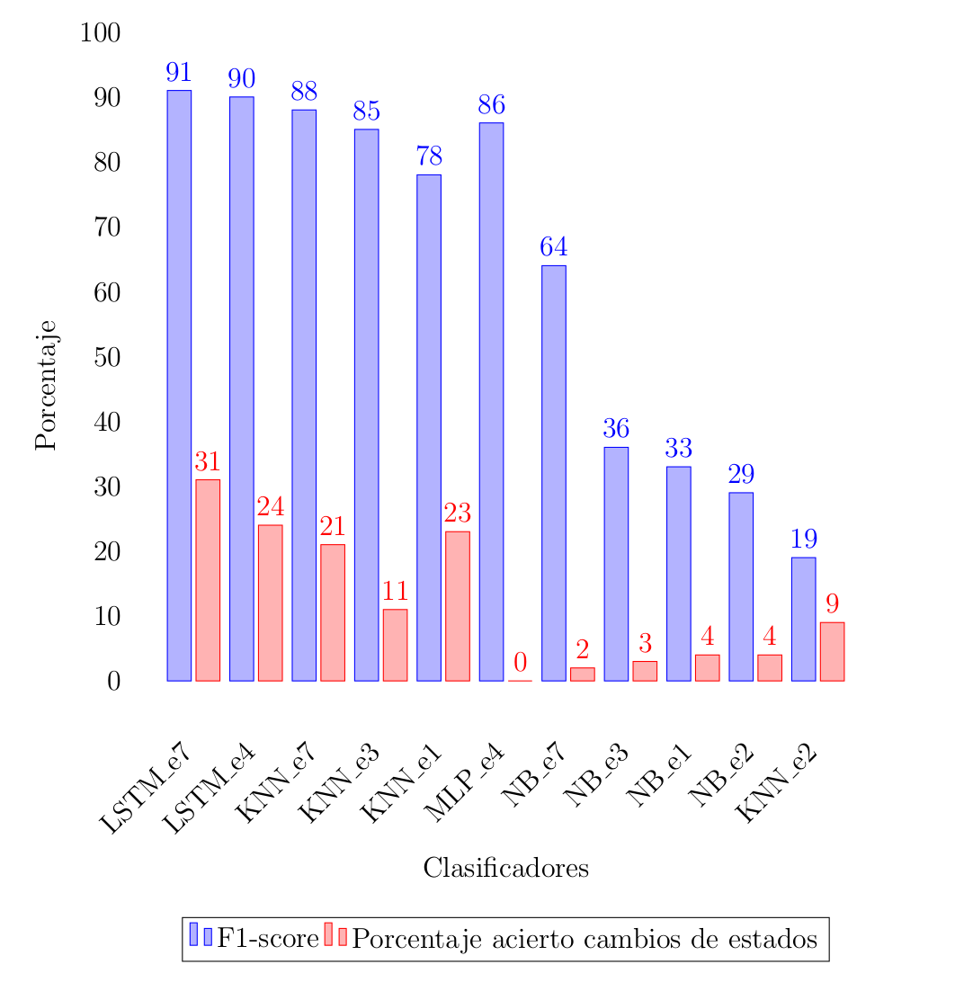
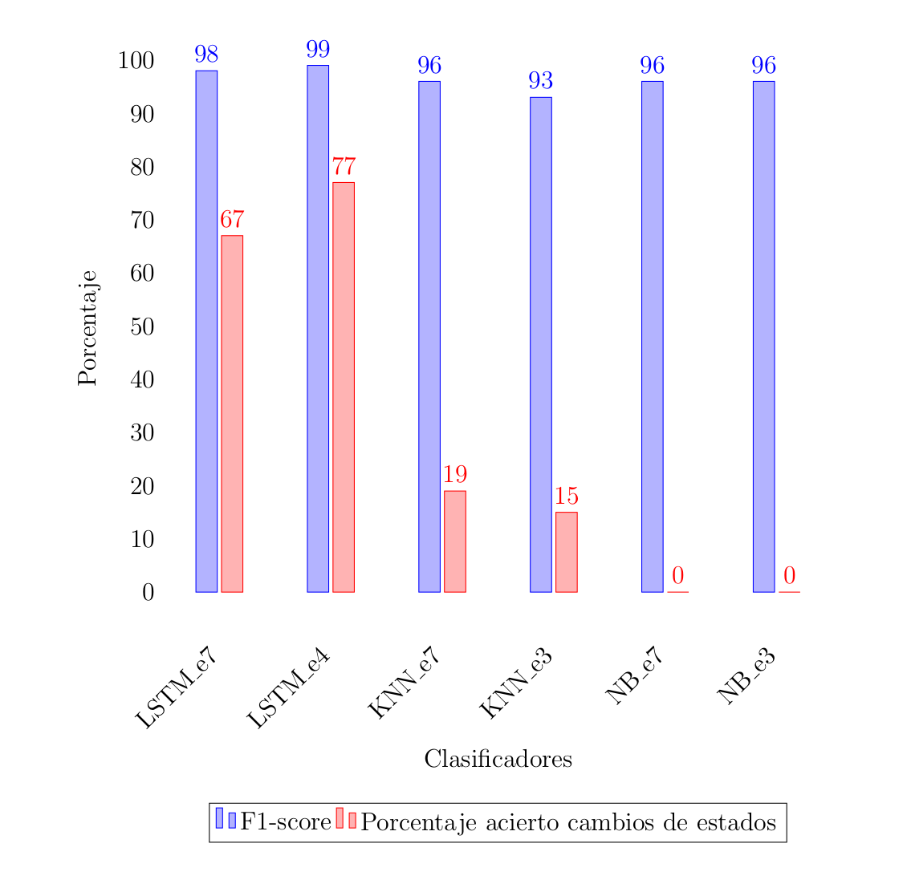
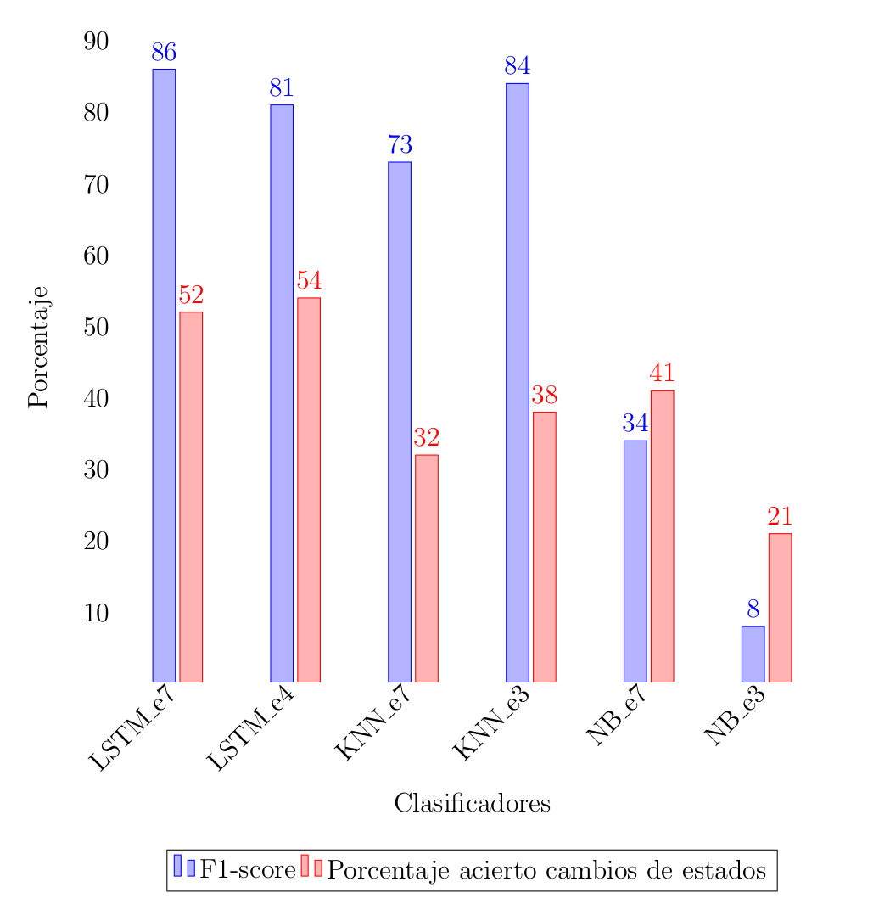

# Resultados

### Escenarios de prueba

Los métodos de aprendizaje automático con los que se trabajó en el proyecto de grado son miembros de la familia de los métodos supervisados, por lo cual necesitan de datos etiquetados para poder reafirmar o corregir los resultados durante el entrenamiento.
Esta investigación tuvo como pilar fundamental los datos provistos por el repositorio de datos UKDALE. Sobre la información que el conjunto de datos provee, se idearon distintos escenarios de evaluación con el objetivo de encontrar el conjunto de características que mejor identifica al comportamiento de los electrodomésticos. Las características consideradas en la etapa de evaluación experimental fueron las siguientes:

  * CONSUMO_AGREGADO: es un valor real que representa el consumo agregado del hogar en el instante de tiempo anterior. 

  * ENCENDIDO_ANTERIOR: es una característica booleana que indica si el electrodoméstico se encontraba encendido en el instante de tiempo anterior. El valor 1 se corresponde con el encendido del electrodoméstico y el valor 0 con el apagado.
    
  * ESTADO_ANTERIOR: es una característica que extiende ENCENDIDO_ANTERIOR para la variante del problema con múltiples niveles de consumo. Es un valor entero que corresponde al identificador del estado en el cual se encontraba el electrodoméstico en el instante de tiempo anterior. 

  * TIEMPO_APAGADO: es una característica que toma valores enteros mayores o iguales a cero e indica el tiempo en segundos transcurridos desde que se registró el último encendido del electrodoméstico. 

  * TIEMPO_ENCENDIDO: es una característica que toma valores enteros mayores o iguales a cero e indica el tiempo en segundos transcurridos desde que se registró el último apagado del electrodoméstico. 

  * FIN_SEMANA: es una característica booleana que indica si el instante en el que se realizó la medición de consumo corresponde a un día de semana o a fin de semana. Toma el valor 0 para los días comprendidos entre lunes y viernes. Toma el valor 1 para los días sábados y domingos. 

  * HORA_DIA: es una característica que indica la hora del día en la que se realizó la medición de consumo. Toma valores enteros entre 0 y 23. 
 
  * VARIACION_CONSUMO: es una característica que toma valores reales e indica la variación del consumo agregado del hogar entre los dos instantes de tiempo anteriores. 

  * FRANJA: es una característica que surge a partir de VARIACION_CONSUMO y busca agrupar aquellas variaciones similares relacionadas con el mismo comportamiento de un electrodoméstico. Las franjas son intervalos de consumo cuyo ancho es el valor de consumo standby. El valor de esta característica está dado por la siguiente expresión: 
  
  **FRANJA = round(VARIACION\_CONSUMO/consumo\_standby)**

A modo de resumen se presenta una tabla que ilustra la variante del problema para el que fue diseñado el escenario conjuntamente con las características que lo conforman.

### Resultados sobre hogares vistos durante entrenamiento 

Los resultados que se presentan a continuación estan relacionados con la evaluación de los clasificadores con datos pertenecientes a los mismos hogares con los que fueron entrenados.
Se debe tener en cuenta que los resultados relacionados a escenarios planteados para resolver la variante binaria del problema que se ilustran, están relacionados a la clase prendido. Esta es una decisión que se tomó debido a que los electrodomésticos estudiados en este proyecto se encuentran apagados la mayor parte del tiempo, por tanto los datos de prueba están desbalanceados. Esto implica que, la clase apagado excede en gran proporción a la clase prendido y provoca una mayor facilidad para clasificar las muestras que a ella pertenecen. Se muestran por tanto el F1-Score de la clase prendido, ya que engloba a la precisión y el recall, y la capacidad de detección de cambios de estado.

#### Resultados obtenidos por los clasificadores sobre el lavavajillas

#### Resultados obtenidos por los clasificadores sobre la jarra eléctrica

#### Resultados obtenidos por los clasificadores sobre la heladera

#### Resultados obtenidos por los clasificadores sobre el microondas

#### Resultados obtenidos por los clasificadores sobre el lavarropas

### Resultados sobre hogares no vistos durante entrenamiento

Las conductas de consumo eléctrico dentro de los hogares depende de factores como la composición del núcleo familiar, el nivel socioeconómico, aspectos geográficos y climatológicos, etc. Por este motivo, en este proyecto se decidió estudiar el desempeño de los algoritmos de aprendizaje automático ante patrones de uso desconocidos. Más precisamente, se entrenan todos los clasificadores con datos de un hogar especı́fico, para luego medir la calidad de las predicciones con información de otro.
Los datos de entrenamiento provienen del hogar uno, y los datos de validación y testeo provienen del hogar dos de UKDALE. 
Los electrodomésticos seleccionados para las pruebas fueron la heladera y el microondas, los cuales en la evaluación con hogares vistos durante el entrenamiento obtuvieron los mejores y peores resultados respectivamente.
Los escenarios sobre los cuales se realizaron los experimentos fueron el escenario 3, escenario 4 y el escenario 7, haciendo uso de todos los clasificadores con excepción de MLP debido a su problema de overfitting.

#### Resultados obtenidos por los clasificadores sobre la heladera

#### Resultados obtenidos por los clasificadores sobre el microondas

